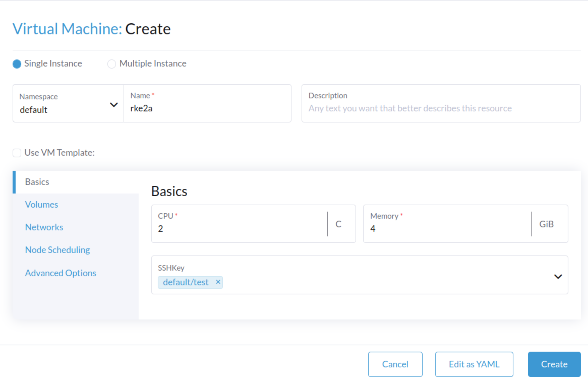
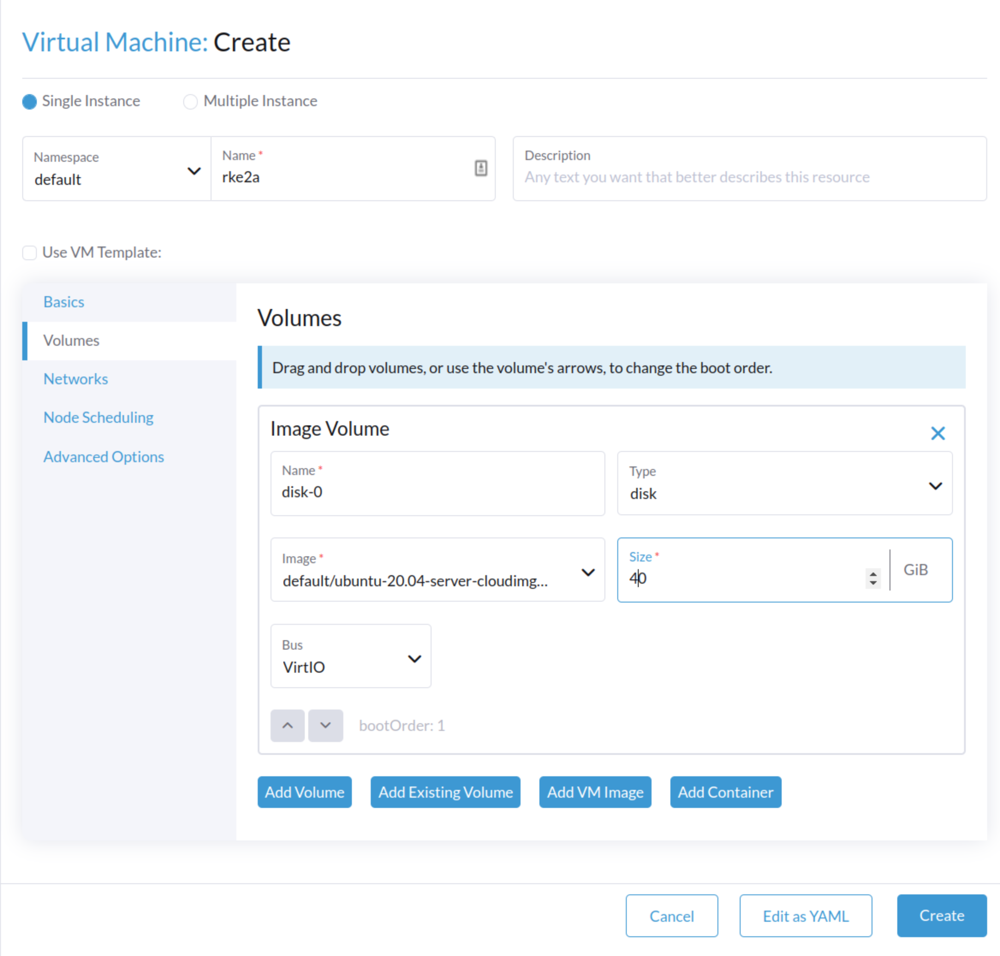
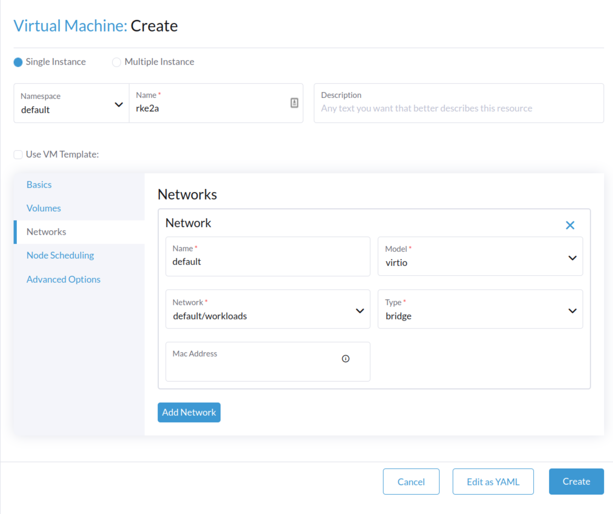
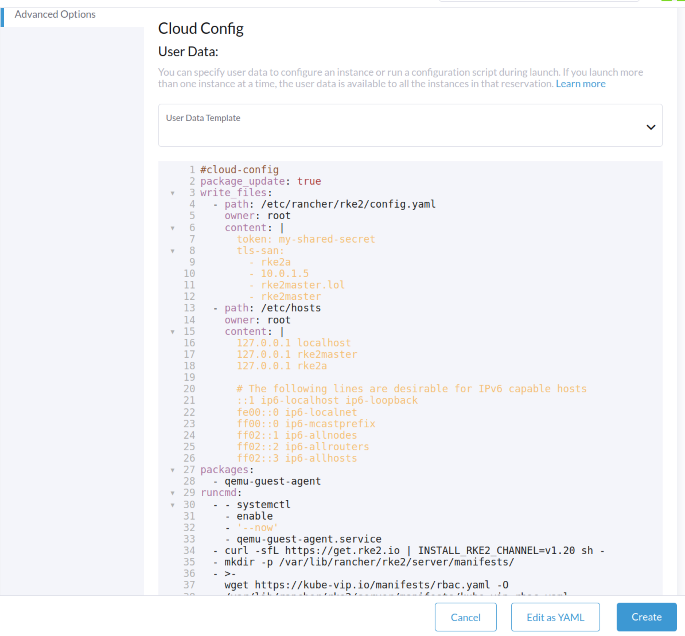
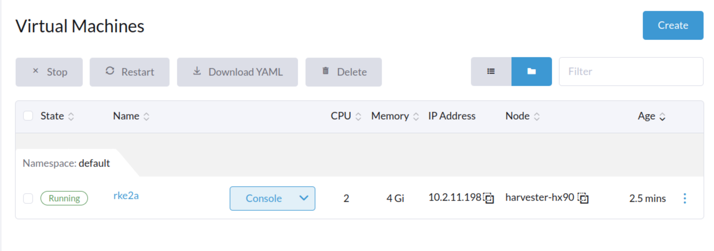
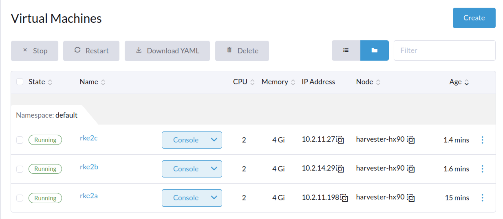

# Bootstrapping an HA RKE2 Cluster easily without a LoadBalancer

---

> **Table of Contents**:
> * [Prerequisites](#prerequisites)
> * [Manual Provisioning](#manual)
> * [Cloud Config Provisioning](#cloud-config)
> * [Conclusion](#conclusion)

---

## Prerequisites

The only pre-req here, other than having access to VMs for this task (I use [Harvester](https://github.com/harvester/harvester) here is either control over DNS entries for each of your nodes or just adding them into an /etc/hosts file on each node. This assumes linux-based VMs, I used Ubuntu 20.04 LTS. This can work in any VM provisioner that supports cloud-init or just lets you SSH in to run a script.

## The Problem
On-prem K8S installations tend to lack cloud-native services like Load Balancing. When building an HA (high availability) cluster, the K8S api-server must be hosted across multiple control-plane/master nodes in the event of a failure. Traditionally for K8S deployments and services, this would require usage of MetalLB, HAProxy, nginx, or some loadbalancer service/daemonset. Unfortunately this case cannot work for the api-server as there would be a circular dependency introduced as these services are deployed via the api-server, they are dynamic deployments/daemonsets/statefulsets.

## The Solution

Enter kube-vip, the solution to this problem as it can be run as a static Pod or static DaemonSet as part of the first RKE2 master. Utilizing code already supported in K3S, we can inject this static DaemonSet and do a quick change/replace of some minimal config items and we are good. It's easy enough to drop into any Ansible playbook or using a more cloud-native approach: cloud-init.

A VIP is short for a Virtual-IP and is common industry vernacular. Essentially a single network interface (such as eth0 for instance) binds to multiple IP addresses instead of just one. If you are using DHCP for VM IP assignment, please ensure there are static IPs available to be claimed as well. For instance, on my workload setup, the first 10 IP addresses are static and my DHCP server only assigns IPs from x.y.z.12 through x.y.z.254.

## Prep
In this guide, I will be setting up a 3-node HA RKE2 cluster. I use the `.lol` domain but swap out for the domain of your choosing. 

| Host       | Type       | IP       | Notes                                                                                                                         |
|------------|------------|----------|-------------------------------------------------------------------------------------------------------------------------------|
| rke2a      | VM         | 10.0.1.2 | etcd                                                                                                                          |
| rke2b      | VM         | 10.0.1.3 | etcd                                                                                                                          |
| rke2c      | VM         | 10.0.1.4 | etcd                                                                                                                          |
| rke2master | VIP        | 10.0.1.5 | You will define this IP on your own. Make sure that it is not currently allocated to a node (and remove from DHCP allocation) |

If you do not have a DNS server available/configured, the `/etc/hosts` file on each node will need to include the following.
```txt
rke2a 10.0.1.2
rke2b 10.0.1.3
rke2c 10.0.1.4
rke2master 10.0.1.5
```

As we progress below, we'll be defining variables and such assuming we wish to construct this into a script and a cloud-init within our VM provisioner.

## Manual Provisioning

### Grab the RKE2 goods
Firstly, we need to grab the RKE2 goods for our VM. This needs to be done on all 3 VMs. That's easy to do using the `get.rke2.io` endpoint:
```console
root@rke2a:~# curl -sfL https://get.rke2.io | INSTALL_RKE2_CHANNEL=v1.20 sh -
[INFO]  finding release for channel v1.20
[INFO]  using v1.20.15+rke2r2 as release
[INFO]  downloading checksums at https://github.com/rancher/rke2/releases/download/v1.20.15+rke2r2/sha256sum-amd64.txt
[INFO]  downloading tarball at https://github.com/rancher/rke2/releases/download/v1.20.15+rke2r2/rke2.linux-amd64.tar.gz
[INFO]  verifying tarball
[INFO]  unpacking tarball file to /usr/local
```
###  Grab kube-vip from K3S
Next we need to create a manifests directory for storing our kube-vip static manifests, grab kube-vip's RBAC objects as well as the DaemonSet spec; only on the first VM. This is done using `wget https://kube-vip.io/manifests/rbac.yaml -O /var/lib/rancher/rke2/server/manifests/kube-vip-rbac.yaml` to copy the rbac manifest into the directory we've created. Follow this by retrieving the k3s kube-vip configuration using the `kube-vip.io/k3s` host as part of a curl request. Note our VIP address and VIP interface (the real interface name on our VM we want the VIP bound to) are used here. We are defining them using a bash export call.
```console
root@rke2a:~# export RKE2_VIP_IP=10.0.1.5
root@rke2a:~# export RKE2_VIP_INTERFACE=eth0
root@rke2a:~# mkdir -p /var/lib/rancher/rke2/server/manifests/
root@rke2a:~# wget https://kube-vip.io/manifests/rbac.yaml -O /var/lib/rancher/rke2/server/manifests/kube-vip-rbac.yaml
--2022-07-14 18:57:18--  https://kube-vip.io/manifests/rbac.yaml
Resolving kube-vip.io (kube-vip.io)... 34.75.209.36, 52.5.183.223
Connecting to kube-vip.io (kube-vip.io)|34.75.209.36|:443... connected.
HTTP request sent, awaiting response... 200 OK
Length: 792 [application/x-yaml]
Saving to: ‘/var/lib/rancher/rke2/server/manifests/kube-vip-rbac.yaml’

/var/lib/rancher/rke2/server/ 100%[=================================================>]     792  --.-KB/s    in 0s      

2022-07-14 18:57:18 (223 MB/s) - ‘/var/lib/rancher/rke2/server/manifests/kube-vip-rbac.yaml’ saved [792/792]

root@rke2a:~# curl -sL kube-vip.io/k3s |  vipAddress=${RKE2_VIP_IP} vipInterface=${RKE2_VIP_INTERFACE} sh | sudo tee /var/lib/rancher/rke2/server/manifests/vip.yaml
apiVersion: apps/v1
kind: DaemonSet
metadata:
  creationTimestamp: null
  name: kube-vip-ds
  namespace: kube-system
spec:
  selector:
    matchLabels:
      name: kube-vip-ds
  template:
    metadata:
      creationTimestamp: null
      labels:
        name: kube-vip-ds
    spec:
      containers:
      - args:
        - manager
        env:
        - name: vip_arp
          value: "true"
        - name: vip_interface
          value: eth0
        - name: port
          value: "6443"
        - name: vip_cidr
          value: "32"
        - name: cp_enable
          value: "true"
        - name: cp_namespace
          value: kube-system
        - name: svc_enable
          value: "false"
        - name: vip_address
          value: 10.0.1.5
        image: ghcr.io/kube-vip/kube-vip:v0.3.7
        imagePullPolicy: Always
        name: kube-vip
        resources: {}
        securityContext:
          capabilities:
            add:
            - NET_ADMIN
            - NET_RAW
            - SYS_TIME
      hostNetwork: true
      nodeSelector:
        node-role.kubernetes.io/master: "true"
      serviceAccountName: kube-vip
      tolerations:
      - effect: NoSchedule
        key: node-role.kubernetes.io/master
  updateStrategy: {}
status:
  currentNumberScheduled: 0
  desiredNumberScheduled: 0
  numberMisscheduled: 0
  numberReady: 0
```

### Configure RKE2
Next we need to create a basic rke2 configuration file. This is picked up by our later RKE2 service init. We only need to create a `/etc/rancher/rke2` directory and then define a simple yaml file inside. This is only necessary on the first VM.
```console
export TOKEN="my-shared-secret"

mkdir -p /etc/rancher/rke2
touch /etc/rancher/rke2/config.yaml
echo "token: ${TOKEN}" >> /etc/rancher/rke2/config.yaml
echo "tls-san:" >> /etc/rancher/rke2/config.yaml 
echo "  - ${HOSTNAME}.lol" >> /etc/rancher/rke2/config.yaml
echo "  - ${HOSTNAME}" >> /etc/rancher/rke2/config.yaml
echo "  - rke2master.lol" >> /etc/rancher/rke2/config.yaml
echo "  - rke2master" >> /etc/rancher/rke2/config.yaml
```

Contents of the file we just created:
```yaml
token: my-shared-secret
tls-san:
  - rke2a.lol
  - rke2a
  - 10.0.1.5
  - rke2master.lol
  - rke2master
```

### Configure /etc/hosts
The last step of prep is to edit the `/etc/hosts` file on all VMs to reflect our table above. Our `/etc/hosts` file for the first VM should look like this on an Ubuntu box. The first VM does not need to know the IP addresses of the other nodes.
```console
root@rke2a:~# cat /etc/hosts
127.0.0.1 localhost
127.0.0.1 rke2master
127.0.0.1 rke2a

# The following lines are desirable for IPv6 capable hosts
::1 ip6-localhost ip6-loopback
fe00::0 ip6-localnet
ff00::0 ip6-mcastprefix
ff02::1 ip6-allnodes
ff02::2 ip6-allrouters
ff02::3 ip6-allhosts
```


## We have LiftOff
Now that our VM is properly configured, let's light this candle! Init and start the RKE2 service:
```console
root@rke2a:~# systemctl enable rke2-server.service
root@rke2a:~# systemctl start rke2-server.service
```
### Verifying
Kubectl is included as part of the RKE2 install, but it is located in a non-default directory. Use it to determine the node state and wait for it to go ready:
```console
/var/lib/rancher/rke2/bin/kubectl \
        --kubeconfig /etc/rancher/rke2/rke2.yaml get nodes
```
```console
root@rke2a:~# /var/lib/rancher/rke2/bin/kubectl         --kubeconfig /etc/rancher/rke2/rke2.yaml get nodes
NAME    STATUS     ROLES                       AGE   VERSION
rke2a   NotReady   control-plane,etcd,master   10s   v1.20.15+rke2r2
```

Once the node is ready, you can inspect the state of the pods:
```
/var/lib/rancher/rke2/bin/kubectl \
        --kubeconfig /etc/rancher/rke2/rke2.yaml get pods --all-namespaces
```
```console
root@rke2a:~# /var/lib/rancher/rke2/bin/kubectl \
>         --kubeconfig /etc/rancher/rke2/rke2.yaml get pods --all-namespaces
NAMESPACE     NAME                                                   READY   STATUS      RESTARTS   AGE
kube-system   cloud-controller-manager-rke2a                         1/1     Running     0          47s
kube-system   etcd-rke2a                                             1/1     Running     0          23s
kube-system   helm-install-rke2-canal-zvm5s                          0/1     Completed   0          34s
kube-system   helm-install-rke2-coredns-8rxkk                        0/1     Completed   0          34s
kube-system   helm-install-rke2-ingress-nginx-kvfv9                  0/1     Pending     0          34s
kube-system   helm-install-rke2-metrics-server-z2pvz                 0/1     Pending     0          34s
kube-system   kube-apiserver-rke2a                                   1/1     Running     0          10s
kube-system   kube-controller-manager-rke2a                          1/1     Running     0          47s
kube-system   kube-proxy-rke2a                                       1/1     Running     0          43s
kube-system   kube-scheduler-rke2a                                   1/1     Running     0          48s
kube-system   kube-vip-ds-hwqdc                                      1/1     Running     0          8s
kube-system   rke2-canal-cqkc4                                       1/2     Running     0          22s
kube-system   rke2-coredns-rke2-coredns-7655b75678-b4rwh             0/1     Pending     0          22s
kube-system   rke2-coredns-rke2-coredns-autoscaler-c9f9f7c49-wmjbf   0/1     Pending     0          22s
```

You can then verify the local network interface has bound to the VIP:
```console
root@rke2a:~# ip addr
2: eth0: <BROADCAST,MULTICAST,UP,LOWER_UP> mtu 1500 qdisc fq_codel state UP group default qlen 1000
    link/ether 0a:2a:07:70:7d:71 brd ff:ff:ff:ff:ff:ff
    inet 10.2.11.198/16 brd 10.2.255.255 scope global dynamic enp1s0
       valid_lft 85046sec preferred_lft 85046sec
    inet 10.2.0.5/32 scope global enp1s0
       valid_lft forever preferred_lft forever
    inet6 fe80::82a:7ff:fe70:7d71/64 scope link 
       valid_lft forever preferred_lft forever
```

### Adding Nodes
Once this first node is finished, log into each additional node to perform the joining. Here we're setting `/etc/hosts` on rke2b:
```text
root@rke2b:~# cat /etc/hosts
127.0.0.1 localhost
10.0.1.2 rke2a
10.0.1.3 rke2b 
10.0.1.4 rke2c 
10.0.1.5 rke2master

# The following lines are desirable for IPv6 capable hosts
::1 ip6-localhost ip6-loopback
fe00::0 ip6-localnet
ff00::0 ip6-mcastprefix
ff02::1 ip6-allnodes
ff02::2 ip6-allrouters
ff02::3 ip6-allhosts
```

Next set the rke2 config with the token and server address of the first node.
```console
export TOKEN="my-shared-secret"

mkdir -p /etc/rancher/rke2
touch /etc/rancher/rke2/config.yaml
echo "token: ${TOKEN}" >> /etc/rancher/rke2/config.yaml
echo "server: https://rke2master.lol:9345" >> /etc/rancher/rke2/config.yaml
echo "tls-san:" >> /etc/rancher/rke2/config.yaml
echo "  - ${HOSTNAME}.lol" >> /etc/rancher/rke2/config.yaml
echo "  - ${HOSTNAME}" >> /etc/rancher/rke2/config.yaml
echo "  - rke2master.lol" >> /etc/rancher/rke2/config.yaml
echo "  - rke2master" >> /etc/rancher/rke2/config.yaml
```

Contents of the file we just created:
```yaml
token: my-shared-secret
server: https://rke2master.lol:9345
tls-san:
  - rke2b.lol
  - rke2b
  - rke2master.lol
  - rke2master
```

Kick the process off on and it should join your master node in an HA configuration.
```console
root@rke2b:~# curl -sfL https://get.rke2.io | INSTALL_RKE2_CHANNEL=v1.20 sh -
[INFO]  finding release for channel v1.20
[INFO]  using v1.20.15+rke2r2 as release
[INFO]  downloading checksums at https://github.com/rancher/rke2/releases/download/v1.20.15+rke2r2/sha256sum-amd64.txt
[INFO]  downloading tarball at https://github.com/rancher/rke2/releases/download/v1.20.15+rke2r2/rke2.linux-amd64.tar.gz
[INFO]  verifying tarball
[INFO]  unpacking tarball file to /usr/local

root@rke2b:~# systemctl enable rke2-server.service
root@rke2b:~# systemctl start rke2-server.service
```

Just as before, you can query the state of the node once everything is bootstrapped, you should see all nodes as part of the cluster. In this example on rke2b, we see two:
```console
root@rke2b:~# /var/lib/rancher/rke2/bin/kubectl         --kubeconfig /etc/rancher/rke2/rke2.yaml get nodes
NAME    STATUS   ROLES                       AGE     VERSION
rke2a   Ready    control-plane,etcd,master   5m58s   v1.20.15+rke2r2
rke2b   Ready    control-plane,etcd,master   31s     v1.20.15+rke2r2
```

## The Solution (Cloud-Init Provisioning using Harvester!)
That's a big list of stuff to do and you can imagine it can become very toilsome to manage at scale. Let's leverage our VM provisioner to automate all this effort and turn it into a point and click affair!

In this example, I'll use Harvester to build a cloud-init that I can use as a template for each node. What we do here is capture the above steps in a more script-y format and drop them into a cloud-init yaml spec. 

### Create First VM
Inspect the [cloud-init-main.yaml](cloud-init/cloud-init-main.yaml) file and see how we narrowed down the scope of the change to something that needed less manual input, specifically in the `/etc/hosts` and `/etc/rancher/rke2/config.yaml` specs under `write_files`. Instead of using `touch`, we are using a feature of cloud-init to create a file with specific contents in a specific location.

#### /etc/hosts
Under `write_files` we can see `/etc/hosts` in the spec below. Please note that the primary VM only needs to know how to reach itself. All other comms are initiated by the other two nodes, only they need actual IP addresses. And in that case, they only need to know how to reach rke2master (which is a VIP address and static). Here we ensure that the first node can always reach itself, this is important for kube-vip to initialize.
```yaml
  - path: /etc/hosts
    owner: root
    content: |
      127.0.0.1 localhost
      127.0.0.1 rke2master
      127.0.0.1 rke2a

      # The following lines are desirable for IPv6 capable hosts
      ::1 ip6-localhost ip6-loopback
      fe00::0 ip6-localnet
      ff00::0 ip6-mcastprefix
      ff02::1 ip6-allnodes
      ff02::2 ip6-allrouters
      ff02::3 ip6-allhosts
```

#### /etc/rancher/rke2/config.yaml
Also under `write_files` we have the `config.yaml` file that defines the tls-san endpoints as well as a shared secret. This secret is a string literal, it does not reference another secret. This token needs to also be present in the `config.yaml` file on the other two nodes. Also note that we are using an IP-SAN here to ensure the kubeconfig that gets generated allows for the hostname to optionally be the static IP provisioned by `kube-vip`.
```yaml
  - path: /etc/rancher/rke2/config.yaml
    owner: root
    content: |
      token: my-shared-secret
      tls-san:
        - rke2a
        - 10.0.1.5
        - rke2master.lol
        - rke2master
```

Creating a VM in Harvester is super easy, and if we really wanted to make this a productionized process, we would create templates for these cloud configurations as well as the VM spec. However, this is just a basic implementation and its more important to highlight the solution, and not any gold-plating that can go on after.

I'm using a bone-stock Ubuntu 20.04 cloud image from Canonical. You can add this via the Images tab and just add a URL-based link to `https://cloud-images.ubuntu.com/releases/focal/release/ubuntu-20.04-server-cloudimg-amd64.img`. Everything else should autofill.

#### VM Create
The following steps can be followed for all VMs as their baselines are identical other than their names. Their names are very important as this translates into the hostname of the VM instance itself.

Go to the `Virtual Machines` tab and click `create`. The VM creation UI interface will show. Name the VM `rke2a`, `rke2b`, or `rke2c` based on our manual example, give it 2 CPUs and 4GB of memory, add an SSH key in as well (you'll need it).


Go to `Volumes`, and ensure an `Image Volume` exists, if not create one and delete the original. Choose your stock cloud image and set the size to ~20-40gb.


Go to `Networks`, and ensure you choose the network that allows for static IP claims.


#### Cloud-Config
In Advanced Options, we inject our cloud config into the User Data field. In this case, we are configuring the primary VM sowe are using the main yaml spec, which can be found [here](cloud-init/cloud-init-main.yaml).


#### Start the VM
Now all the fields have been filled, go ahead and click the `create` button at the bottom. And we'll wait for the VM to start, get an IP address, and bootstrap the first node from the cloud-config we just specified. I used a different IP range in my own demo rig so don't be confused by the IP address in the status.


Once the VM starts, we can SSH into it and verify that the VIP we wanted is bound to the correct interface. This is a good way of ensuring that kube-vip started successfully! Also, in this example I used a VIP of 10.2.0.5 in my demo rig and the network interface is `enp1s0`. We can see below that kube-vip successfully bound its IP.
```console
root@rke2a:~# ip addr
1: lo: <LOOPBACK,UP,LOWER_UP> mtu 65536 qdisc noqueue state UNKNOWN group default qlen 1000
    link/loopback 00:00:00:00:00:00 brd 00:00:00:00:00:00
    inet 127.0.0.1/8 scope host lo
       valid_lft forever preferred_lft forever
    inet6 ::1/128 scope host 
       valid_lft forever preferred_lft forever
2: enp1s0: <BROADCAST,MULTICAST,UP,LOWER_UP> mtu 1500 qdisc fq_codel state UP group default qlen 1000
    link/ether 06:f7:30:f9:35:0a brd ff:ff:ff:ff:ff:ff
    inet 10.2.11.198/16 brd 10.2.255.255 scope global dynamic enp1s0
       valid_lft 86136sec preferred_lft 86136sec
    inet 10.2.0.5/32 scope global enp1s0
       valid_lft forever preferred_lft forever
```

### Create Remaining VMs
Following the steps outlined above, create the other two VMs named `rke2b` and `rke2c` with exception of the cloud-init step. Instead of using the main spec, use the join spec located [here](cloud-init/cloud-init-join.yaml). I'll cover the differences below. See the image showing all 3 VMs running, and understand the IP differences here are due to the demo rig's setup (a 10.2/16 CIDR with DHCP vs static).


#### /etc/hosts
On the joining nodes, our `/etc/hosts` file looks slightly different. As I mentioned earlier, the joining nodes are the only nodes that need to know how to reach `rke2master/rke2a`. That is obvious in the spec below. Note that the rke2master entry is using the VIP address and both rke2b and rke2c are using a loopback address. This is to ensure this same `/etc/hosts` file can be used on either VM. Each node will be capable of reaching back to the main node as well as communicate with themselves.
```yaml
  - path: /etc/hosts
    owner: root
    content: |
      127.0.0.1 localhost
      10.0.1.5 rke2master
      127.0.0.1 rke2b
      127.0.0.1 rke2c

      # The following lines are desirable for IPv6 capable hosts
      ::1 ip6-localhost ip6-loopback
      fe00::0 ip6-localnet
      ff00::0 ip6-mcastprefix
      ff02::1 ip6-allnodes
      ff02::2 ip6-allrouters
      ff02::3 ip6-allhosts
```

#### /etc/rancher/rke2/config.yaml
Here we are setting the rke2 config for the cluster on the joining nodes, so we've included the same token defined for the primary VM as well as including a new line `server` to instruct the node that it will need to join a cluster already running at that address. Note that it is not using a 'real' URL, but is using an entry defined in its own `/etc/hosts` file above.
```yaml
  - path: /etc/rancher/rke2/config.yaml
    owner: root
    content: |
      token: my-shared-secret
      server: https://rke2master:9345
      tls-san:
        - rke2b
        - rke2c
        - 10.0.1.5
        - rke2master.lol
        - rke2master
```

### Verifying the Join
Once the other VMs have had time to start and join, we can verify the whole cluster is running with 3 master nodes by hopping onto the primary VM and running our commands as we did in the manual example. Here we can see a successful joining.
```console
root@rke2a:~# /var/lib/rancher/rke2/bin/kubectl \
>         --kubeconfig /etc/rancher/rke2/rke2.yaml get nodes
NAME    STATUS   ROLES                       AGE   VERSION
rke2a   Ready    control-plane,etcd,master   14m   v1.20.15+rke2r2
rke2b   Ready    control-plane,etcd,master   57s   v1.20.15+rke2r2
rke2c   Ready    control-plane,etcd,master   25s   v1.20.15+rke2r2
```

The last step is to grab the kubeconfig onto our local machine and do an IP address change to the kube-vip address.

## Get Kubeconfig
Grab the kubeconfig from one of the master nodes `/etc/rancher/rke2/rke2.yaml` and ensure you replace `127.0.0.1` with your kube-vip IP address (in our example, that's `10.0.1.5`, but on my demo rig that is 10.2.0.5).
```console
ubuntu@rke2a:~$ sudo cp /etc/rancher/rke2/rke2.yaml config
ubuntu@rke2a:~$ sudo chown ubuntu:ubuntu config
ubuntu@rke2a:~$ exit
logout
Connection to 10.2.11.198 closed.
bdurden@bdurden-XPS-13-9370:~/rancher$ scp ubuntu@10.2.11.198:./config ~/.kube/config
config                                                                                100% 2969   648.3KB/s   00:00 
bdurden@bdurden-XPS-13-9370:~/rancher$ sed -ie 's/127.0.0.1/10.2.0.5/g' ~/.kube/config
bdurden@bdurden-XPS-13-9370:~/rancher$ kubectl get nodes
NAME    STATUS   ROLES                       AGE     VERSION
rke2a   Ready    control-plane,etcd,master   19m     v1.20.15+rke2r2
rke2b   Ready    control-plane,etcd,master   5m7s    v1.20.15+rke2r2
rke2c   Ready    control-plane,etcd,master   4m35s   v1.20.15+rke2r2
bdurden@bdurden-XPS-13-9370:~/rancher$ kubectl get po -A
NAMESPACE     NAME                                                   READY   STATUS      RESTARTS   AGE
kube-system   cloud-controller-manager-rke2a                         1/1     Running     0          19m
kube-system   cloud-controller-manager-rke2b                         1/1     Running     0          5m50s
kube-system   cloud-controller-manager-rke2c                         1/1     Running     0          5m49s
kube-system   etcd-rke2a                                             1/1     Running     0          19m
kube-system   etcd-rke2b                                             1/1     Running     0          6m7s
kube-system   etcd-rke2c                                             1/1     Running     0          5m36s
kube-system   helm-install-rke2-canal-ll2q8                          0/1     Completed   0          20m
kube-system   helm-install-rke2-coredns-kwv7r                        0/1     Completed   0          20m
kube-system   helm-install-rke2-ingress-nginx-cfqvp                  0/1     Completed   0          20m
kube-system   helm-install-rke2-metrics-server-mzvsm                 0/1     Completed   0          20m
kube-system   kube-apiserver-rke2a                                   1/1     Running     0          19m
kube-system   kube-apiserver-rke2b                                   1/1     Running     0          5m43s
kube-system   kube-apiserver-rke2c                                   1/1     Running     0          5m23s
kube-system   kube-controller-manager-rke2a                          1/1     Running     0          19m
kube-system   kube-controller-manager-rke2b                          1/1     Running     0          5m37s
kube-system   kube-controller-manager-rke2c                          1/1     Running     0          5m50s
kube-system   kube-proxy-rke2a                                       1/1     Running     0          19m
kube-system   kube-proxy-rke2b                                       1/1     Running     0          5m37s
kube-system   kube-proxy-rke2c                                       1/1     Running     0          5m49s
kube-system   kube-scheduler-rke2a                                   1/1     Running     0          19m
kube-system   kube-scheduler-rke2b                                   1/1     Running     0          5m39s
kube-system   kube-scheduler-rke2c                                   1/1     Running     0          5m50s
kube-system   kube-vip-ds-gj444                                      1/1     Running     0          5m31s
kube-system   kube-vip-ds-qsq8w                                      1/1     Running     0          19m
kube-system   kube-vip-ds-r8dzp                                      1/1     Running     0          6m3s
kube-system   rke2-canal-hzrwm                                       2/2     Running     0          19m
kube-system   rke2-canal-n8nxs                                       2/2     Running     0          6m23s
kube-system   rke2-canal-pds62                                       2/2     Running     0          5m51s
kube-system   rke2-coredns-rke2-coredns-7655b75678-6qwzt             1/1     Running     0          6m16s
kube-system   rke2-coredns-rke2-coredns-7655b75678-klmp6             1/1     Running     0          19m
kube-system   rke2-coredns-rke2-coredns-autoscaler-c9f9f7c49-mc7zn   1/1     Running     0          19m
kube-system   rke2-ingress-nginx-controller-ht7gs                    1/1     Running     0          6m3s
kube-system   rke2-ingress-nginx-controller-t8w7d                    1/1     Running     0          5m31s
kube-system   rke2-ingress-nginx-controller-wfmxs                    1/1     Running     0          19m
kube-system   rke2-metrics-server-7fdddc8c67-fbqmj                   1/1     Running     0          19m
```

## Conclusion

While the steps above are long to describe, they are actually very quick/easy in practice. All we're doing is pulling down a kube-vip config from official K3S channels and re-purposing it for RKE2. Now go try and reproduce in your own environment! These cloud-init configurations and manual steps should work on nearly any Linux-based OS!


